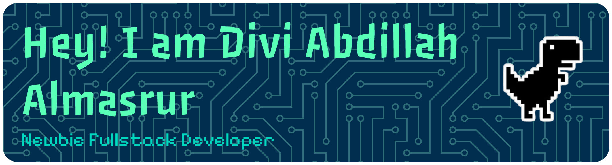

    
    <h1>Halo! Saya [Nama Anda] 👋</h1>
    
Selamat datang di taman bermain digital saya! Saya seorang [Profesi/Gelar Anda], bersemangat tentang [Minat Utama Anda].

---

## 🚀 Keahlian dan Teknologi

Saya senang bekerja dengan teknologi berikut:

| Kategori | Teknologi/Bahasa |
| :--- | :--- |
| **Bahasa Pemrograman** | <code></code> <code></code> <code></code> <code></code> |
| **Framework & Library** | <code></code> <code></code> <code></code> |
| **Database & Tools** | <code></code> <code></code> <code></code> |

 

## 🕹️ Zona Bermain (Games!)

Butuh istirahat sejenak? Mari bermain!

### 🐍 Snake Game (Ular)

Gunakan tautan di bawah ini. Cukup klik pada tautan dan Anda bisa bermain!

[Mainkan Game Ular (Snake) di Profil GitHub Saya!](https://github-profile-snake-game.vercel.app/snake.svg?user=USERNAME_GITHUB_ANDA)

> **Catatan:** Ganti `USERNAME_GITHUB_ANDA` dengan username GitHub Anda yang sebenarnya!

### 🧱 Tetris

Untuk game yang lebih kompleks seperti Tetris atau Pac-Man, cara terbaik adalah dengan memberikan tautan atau *link* ke game yang di-*host* di luar (misalnya, di GitHub Pages Anda).

[🎮 Mainkan Tetris di Sini!](LINK_KE_GAME_TETRIS_ANDA)

[👾 Mainkan Pac-Man di Sini!](LINK_KE_GAME_PACMAN_ANDA)

---

## 📈 Statistik GitHub Saya

    

